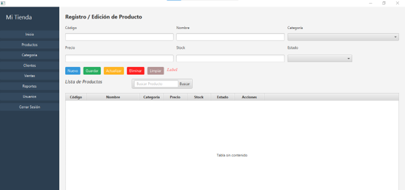

# Sistema de Gestión de Inventario - CRUD JavaFX

## Descripción
Sistema de escritorio robusto y modular diseñado para la gestión de productos de inventario. El sistema permite administrar productos mediante una interfaz gráfica intuitiva, garantizando la integridad de los datos y una navegación fluida entre secciones.

## Captura del Dashboard


## Tecnologías Utilizadas
* **Lenguaje:** Java 17+
* **Interfaz Gráfica:** JavaFX 21
* **Gestión de dependencias:** Apache Maven
* **Patrón de diseño:** MVC (Modelo-Vista-Controlador)
* **Herramienta de UI:** Scene Builder

## Funcionalidades
* **CRUD Completo:** Creación, lectura, actualización y eliminación de productos.
* **Validaciones:** Control de duplicidad mediante código, validación de tipos numéricos y campos obligatorios.
* **Búsqueda Inteligente:** Filtro en tiempo real para localizar productos rápidamente.
* **Arquitectura Escalable:** Carga dinámica de vistas FXML dentro de un contenedor central (`BorderPane`).
* **Tabla Dinámica:** `TableView` enlazada a `ObservableList` para actualización automática de la interfaz.

## Estructura del Proyecto
```text
src/main/java/org/example/crudinterfaz/
├── AdministradorController.java # Control de navegación principal
├── AvanceApplication.java            # Punto de entrada
├── Launcher.java
├── ProductosController.java     # Lógica CRUD de productos
└── Producto.java            # Modelo de datos
src/main/resources/org/example/crudinterfaz/
├── administrador.fxml       # Layout del Dashboard
└── productos.fxml           # Formulario y tabla de productos
´´´
## Instrucciones de Ejecución
* **Requisitos: Tener instalado JDK 17 o superior y el IDE IntelliJ IDEA.
* **Clonar: git clone https://github.com/Alexis-Ch15/Crud_InterfazGrafica 
* **Maven: Esperar a que el proyecto sincronice las dependencias de JavaFX desde el pom.xml.
* **Ejecutar: Ejecutar la clase AvanceApplication.java y el sistema iniciará automáticamente.
